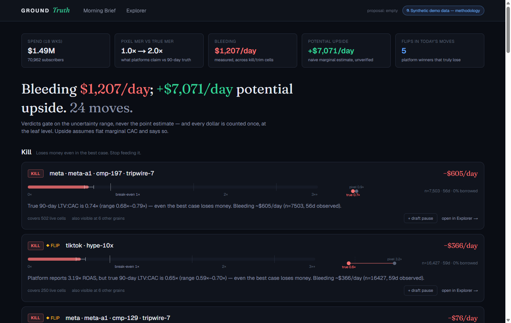
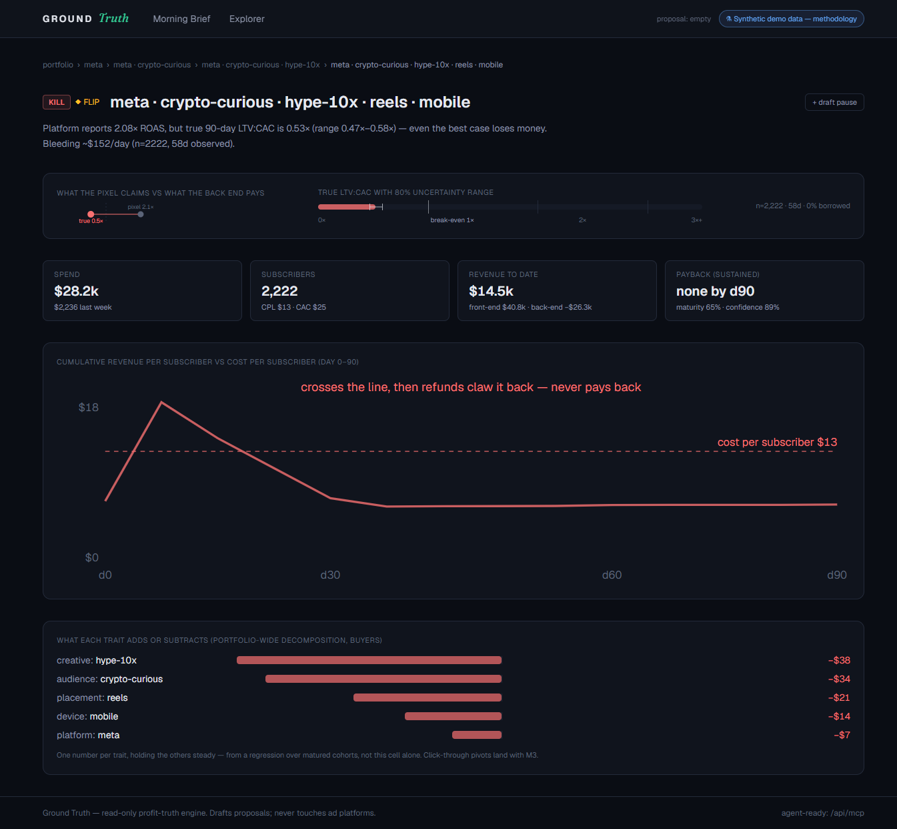
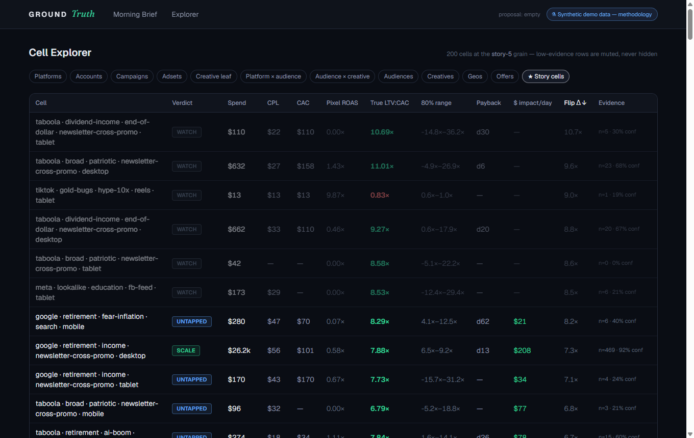
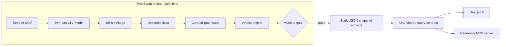

# Ground Truth

**The ad platform says winner. The 90-day back end says loser. Ground Truth is the tool that catches the lie before it scales.**

**Live demo:** https://ground-truth-brown.vercel.app · **Agent endpoint:** `https://ground-truth-brown.vercel.app/api/mcp` · Built for It's Today Media's Build Challenge.

Here's the flip that pays for this entire product: a Meta cell — crypto-curious audience, hype-10x creative, Reels, mobile — reads **2.1× ROAS** in Ads Manager. A clear winner. Scale it. Except that ROAS is impulse buyers smashing a $99 one-time offer inside the platform's 7-day attribution window; Meta books the gross revenue, over-credits itself, and then goes blind. Refunds land at 1.8× the baseline rate over the next month. Nobody renews. True 90-day LTV:CAC on that cell is **0.53** — every dollar in returns about fifty cents. Ground Truth joins back-end subscriber revenue (renewals, upsells, affiliate commissions, refunds) to the exact acquisition cell that bought each subscriber, predicts LTV from first-week behavior so you act in days instead of quarters, shrinks thin cells toward their parents until they've earned trust, and hands the buyer a Morning Brief of confidence-gated verdicts — **SCALE / KILL / TRIM / WATCH / UNTAPPED** — headlined by two numbers, never one: measured bleed (*"Bleeding $1,207/day"*) and hedged upside (*"+$7,071/day potential — naive marginal estimate"*). Platform dashboards grade their own homework. This is the answer key.



---

## What you get

Four surfaces, one set of numbers:

- **Morning Brief** — the two-number headline (bleed measured, upside hedged) and a short stack of move cards: verdict badge, cell path, true LTV:CAC as a bullet bar with an uncertainty whisker against 1×/2×/3× ticks, a platform-vs-truth dumbbell, dollars per day, a maturity badge ("n=2,222 · 58d · 0% borrowed"), and a one-click draft action. Twenty-four moves, not six thousand rows.
- **Explorer** — a dense, sortable cell table at every registered grain: spend, CPL, CAC, platform ROAS, true LTV:CAC with its range, sustained payback day, dollar impact per day, flip divergence. A "★ Story cells" preset takes you to the flip and the untapped in two clicks.
- **Cell Detail** — the proof page for any claim: the flip gauge, the payback curve (which for the flip *crosses cost on day 1, then refunds claw it back — payback: never*), a per-trait tornado, and a provenance panel showing exactly how much of the number is observed vs borrowed vs predicted.
- **Read-only MCP server** — every one of those numbers exposed as tools, so your own Claude can interrogate the demo's data directly. The agent narrates; it never computes.

And one vocabulary, five verdicts:

| Verdict | Plain English |
|---|---|
| **SCALE** | Even the cautious end of the uncertainty range clears the hurdle with margin. Feed it. |
| **KILL** | Even the optimistic end of the range is below hurdle, on material spend. Stop feeding it. |
| **TRIM** | Best estimate is below hurdle but the range still straddles it. Cut, don't zero. |
| **WATCH** | Too thin or too young to call. Shown with a leaning ("leaning KILL") and zero dollar claims. |
| **UNTAPPED** | Starved of spend, but its siblings and its traits say it's rich. The inverse flip. |

Plus one overlay: **◆ FLIP** — the platform calls it a winner and the truth calls it KILL or TRIM. Those get the warning diamond, because they're the ones actively costing money while looking good.



---

## Why this?

FinPub economics are simple and brutal: **the front end exists to break even, and the back end is the business.** You buy media at scale, capture the email/SMS subscriber, and get paid over the next 90 days — renewals, upsells, cross-promotions, affiliate sends. The profit arrives 30 to 90 days after the click, on rails the ad platform has never heard of.

Which means the metric stack splits cleanly in two:

| Metric | What it answers | Where it lives |
|---|---|---|
| CPL | What does a lead cost? | Platform dashboard |
| CAC | What does an owned buyer cost? | Platform dashboard, roughly |
| Front-end ROAS | Did day-0 revenue cover the click? | Platform dashboard — and it's *supposed* to hover near 1.0 |
| 90-day LTV | What is a subscriber from this cell actually worth? | **Nowhere the platform can see** |
| Payback day | When does cumulative revenue cross CAC — *and stay there*? | Nowhere the platform can see |
| Blended MER | Total revenue over total spend — the real scaling dial | Nowhere the platform can see |

Everything above the line is measured well and optimized hard. Everything below the line is where the money is. Ground Truth exists to move the bottom three up to where the decisions get made.

And it's worse than a blind spot, because the numbers the platform *does* report are biased. Platform attribution:

- **stops at 7 days** — right before the revenue that matters starts;
- **counts gross** — refunds and chargebacks are never subtracted, because platforms never see them;
- **over-credits itself** — every platform claims the same conversion, so blended truth is always less than the sum of the dashboards.

That's not a small bias. It's a bias pointed exactly at the most expensive mistake a buyer can make: it **flatters impulse-heavy cells** (fast gross sales, heavy refunds, zero renewals — the flip) and **starves slow-burn cells** (weak 7-day signal, fat 90-day back end — the untapped). Optimize on platform ROAS and you systematically scale your worst cells and kill your best ones. In the demo world, the whole portfolio reads **0.8× on the pixel and 2.0× on 90-day truth** — the two dashboards aren't even telling the same story about whether the business works.

It's Today Media's own media-buyer job ad says the team optimizes "front-end metrics (Cost-Per-Lead, CTR, CVR, ROAS) and downstream value (LTV, payback period, Total ROI)." Ground Truth is the join between those two halves — downstream value attributed back to the granular targeting cell (platform × account × campaign × audience × creative × placement × geo × device × offer × cohort-week) where front-end decisions actually get made.

Off-the-shelf attribution (Triple Whale, Northbeam) won't do this: it's DTC-shaped — order-level ROAS for stores — not subscriber-level 90-day LTV per targeting cell for a publisher whose real P&L is a list.

And the payoff isn't just defense. The buyer who knows true 90-day LTV per cell can steer by blended MER instead of platform ROAS, and can pay a CAC that looks insane to a front-end-only competitor — and win every auction that matters. Knowing the back end per cell is **permission to outbid**.

---

## The honest-synthetic data

Every number in this demo is synthetic — and that's the pitch, not the fine print.

The demo runs on a documented, seeded data-generating process: a miniature FinPub world — 4 platforms, ~200 Zipf-weighted campaigns, 10 targeting dimensions, ~71,000 subscribers over 18 weekly cohorts, and 90 days of revenue per subscriber (front-end sales, one-time-offer upsells, renewals, affiliate commissions, whale accounts, refunds) — then censored at a snapshot date exactly the way real data is censored. Same seed in, byte-identical artifacts out: `npm run generate` reproduces every file in `data/artifacts/`.

Two stories are deliberately planted in that world, and we tell you so:

| | **The flip** | **The untapped** |
|---|---|---|
| Cell | Meta × crypto-curious × hype-10x × Reels × mobile | YouTube × retirement × education × newsletter-cross-promo × desktop |
| What the platform sees | **2.08× ROAS** — gross revenue, 7-day window, over-credited | Weak 7-day signal, so the simulated buyer starves it (~$383 total spend) |
| What's true at day 90 | **0.38 LTV:CAC** (sidecar truth) — refunds at 1.8× baseline, near-zero renewals | **~5× LTV per dollar**, imputed from its traits and siblings |
| Verdict | KILL, flagged ◆ FLIP | UNTAPPED |
| Why it's realistic | Platforms never see refunds; hype buys once and refunds often | High-LTV audiences often photograph badly in week one |

The planted mechanism, abridged (the full multiplier tables ship in [`data/artifacts/truth_effects.json`](data/artifacts/truth_effects.json)):

| Trait | m_feconv (front-end punch) | m_ltv (90-day value) | m_refund |
|---|---|---|---|
| creative: hype-10x | **1.6** | **0.42** | **1.8** |
| audience: crypto-curious | 1.2 | 0.55 | 1.3 |
| creative: education | 0.8 | **1.4** | 0.85 |
| audience: retirement | 0.9 | **1.8** | 0.8 |
| placement: newsletter-cross-promo | 0.85 | 1.5 | 0.8 |
| device: desktop | 0.9 | 1.3 | 0.85 |

Planting isn't cheating — it's what makes the demo *checkable*. Real data would prove nothing here, because with real data neither you nor we would know the right answer. With a planted world, there is a right answer, and you can verify the pipeline finds it.

**The recovery proof, on the shipped seed** (full detail on the [live methodology page](https://ground-truth-brown.vercel.app/methodology) and in [`data/artifacts/recovery.json`](data/artifacts/recovery.json)):

| Check | Result | Gate |
|---|---|---|
| Value effects recovered (corr vs planted, materially planted levels) | **0.89** | ≥ 0.8 |
| Conversion effects recovered | **0.95** | ≥ 0.8 |
| Negative control (permuted answer key, 20 permutations) | **0.15** | ≤ 0.2 |
| Out-of-sample calibration (Σpredicted/Σrealized, held-out cohorts) | **1.07** overall · 1.09 whale · 0.98 rest | 0.9–1.1 |
| Shipped estimate vs naive own-data average, thin cells, scored against long-run expectations pooled from 14 regenerated worlds | **$40.12 vs $44.53** MAE/subscriber | shipped wins |

Two disclosures, because they're how the sausage is actually made: the *offer* dimension is excluded from value-recovery scoring (its engineered effect includes ticket prices and the whale path, not just its planted multiplier — scoring it against the multiplier alone would be a category error; it's still reported in the table), and the shrinkage check is scored against **long-run expected values from regenerated worlds**, because a mature cell's own realized revenue *is* the sidecar truth and comparing them would be circular. Both disclosures ship inside the artifacts themselves.

One thing we will never claim: that the model "rediscovers the DGP." What we claim is stricter and more useful — **the pipeline is scored against ground truth it never reads.** The planted answer key lives in a sidecar file, and an import-graph test asserts that nothing in the model, cube, or query code can even import it. The world it's scored on contains structure the model can't represent — whale gating, zero-inflated revenue, refund dynamics, heavy tails, snapshot censoring — so recovery validates **pipeline correctness, not model-family choice**. The negative control seals it: score the recovered effects against a permuted answer key and the correlation collapses.

A `validate()` gate runs before any artifact ships — both planted stories recoverable, realistic sparsity (61% of leaf cells have ≤5 subscribers — thin cells are the norm), honest headlines, every number finite. **If the planted world isn't recoverable, the build fails.** The current all-green report is baked into [`data/artifacts/meta.json`](data/artifacts/meta.json) and rendered live on the methodology page.



---

## Architecture

One TypeScript repo, one Next.js app on Vercel. The data engine is pure TS with zero framework imports, run as a build-time script that emits static JSON snapshot artifacts. The judged deployment requires no database, no env vars, and no external services it can die on during judging — the Postgres backend, ad-platform connectors, and Google sign-in are all built in and all **optional-on**: each activates when its environment variables exist, and this deployment deliberately ships with none.



Every stage explains itself in a sentence — that's a design rule here, not an accident:

- **Seeded DGP** — the synthetic world described above. Deterministic: regenerate from the same seed and the artifacts are byte-identical.
- **Two-part LTV model** — a subscriber's predicted 90-day value is *the chance they ever buy* times *what buyers like them spend*, learned from cohorts old enough that we already know their answer, then scaled so predictions average out correctly on those known cohorts.
- **EB shrinkage** — a thin cell borrows from its parent until it has earned trust; the UI shows this as "% borrowed from parent," never as a Greek letter.
- **Decomposition** — one number per trait: what "Reels" or "hype-10x" adds or subtracts, holding everything else steady. Two families, one for *whether people buy* and one for *what buyers are worth* — which is exactly how the flip works: hype makes people buy once; it doesn't make them worth anything.
- **Curated-grain cube** — every metric precomputed at 23 registered grains (platform → account → campaign → ad set → creative leaf, plus audience/creative/geo/device/offer cuts and the story grains). No free-form OLAP; every grain that exists is one a buyer would actually act at.
- **Verdict engine** — SCALE / KILL / TRIM / WATCH / UNTAPPED, gated on the **80% uncertainty range**, never the point estimate, with sample and maturity floors enforced *in the engine* — so the UI and the agent can never tell different stories. The Brief is assembled leaf-disjoint: no two cards claim the same dollars.
- **validate gate** — artifacts don't ship unless the planted stories are recoverable and every number is sane.

Downstream of the gate, everything is boring on purpose: **static JSON artifacts** are committed to the repo and baked into the deploy, and **one shared query contract** — a handful of pure functions — is the only way anything reads them. The Next.js UI calls it. The read-only MCP server at `/api/mcp` calls it. Claude connected over MCP **narrates the numbers; it never computes them.**

### Connect your Claude to the demo

```bash
# Claude Code
claude mcp add --transport http ground-truth https://ground-truth-brown.vercel.app/api/mcp

# Claude Desktop (config → mcpServers)
"ground-truth": { "command": "npx", "args": ["mcp-remote", "https://ground-truth-brown.vercel.app/api/mcp"] }
```

Then ask: *"Give me the daily brief."* → *"Why is the biggest flip a KILL?"* → *"Draft the budget changes."* The tools mirror how a buyer works the data:

- `daily_brief` — both headline numbers and the deduplicated move list.
- `rank_cells` — sort any registered grain by true LTV per dollar, flip divergence, or dollar impact.
- `get_cell` / `explain_cell` — one cell's full story: verdict, reason, uncertainty range, % borrowed, per-trait effects.
- `list_flips` — every cell where the platform and the truth disagree, ranked by daily cost.
- `find_untapped` — starved cells whose siblings and traits say they deserve budget.
- `draft_budget_change` — a structured, reversible proposal plus a CSV. **It drafts; it never executes.**

A few rules hold everywhere, because trust is the product:

- **Read-only mandate.** Nothing in this system writes to an ad platform. Proposals are drafts.
- **One contract.** UI and agent read identical numbers from identical functions — they cannot disagree.
- **No verdict without receipts.** Range bounds, sample floors, maturity floors — enforced in the engine, not in UI copy.
- **Every number explainable in a sentence or two.** If a method can't be explained to a media buyer in plain English, it doesn't ship. The methodology page carries the one-sentence gloss next to every formula.
- **Money is integer cents internally.** Formatting happens at the edge; rounding errors don't compound.

### The data layer — built, not promised

At production scale this product *is* a data problem: millions of subscribers, event-level revenue streams, a cube rebuilt nightly. So the storage seam isn't a paragraph in this README — it's implemented and parity-tested in the repo:

- **One interface, two stores.** `GroundTruthStore` (`src/engine/store.ts`) is the only way anything reads data. The demo default serves from baked artifacts; `src/lib/pg/` implements the identical interface against **Postgres** — filtering, ranking, and the parent-chain walk (a recursive CTE) pushed into SQL, with the production DDL and indexes in `src/lib/pg/schema.ts`.
- **Proven equivalent, not claimed equivalent.** `tests/pgstore.test.ts` loads the artifacts into a real Postgres (PGlite — in-process, no Docker) and asserts both backends return **row-identical results** for the same contract calls: every query shape, the flip cell's full detail, the brief, the flips, the typed grain errors.
- **The nightly-snapshot pattern, working:** `DATABASE_URL=... npm run db:load` builds the cube into a staging schema and swaps it atomically — readers never see a half-written world. `DATABASE_URL=... npm run dev` then serves the API and MCP from Postgres instead of artifacts. The deployed demo deliberately ships without a database — nothing that can be cold, paused, or down while a judge is clicking — but the flip is one env var.

**Scaling shape** (why this design): the serving cube stays small even when the business is huge — ~23 curated grains over targeting vocabulary yields tens of thousands of rows whether you have 70k subscribers or 7M. What grows is the *event* side: clicks, opt-ins, revenue events. Production shape: event lake → **DuckDB** nightly cube build → **Postgres** (partitioned by grain, latest snapshots hot, older ones kept as the audit trail) → this exact store interface. Graduate the build to ClickHouse/BigQuery when event volume earns it; **the query contract never changes** — that's the point of the seam, and the parity suite is what keeps it honest.

The other production swap points, same discipline:

- **Spend connectors — scaffolded and tested, not just described.** A live **Meta adapter** (Marketing API v25.0, ad-level Insights with delivery breakdowns, pagination, our placement/device vocab), a **CSV adapter** that onboards any other platform on day one, and the **naming-convention parser** that carries the semantic dimensions (`aud:… | ang:… | off:…`) — all normalizing to one contract, all fixture-tested. A nightly cron (`/api/cron/sync`) pulls every configured connector into the Postgres raw store; configuration is environment secrets per deployment, and [`/connectors`](https://ground-truth-brown.vercel.app/connectors) shows live status. The judged demo deliberately ships with none configured — nothing to expire or rate-limit mid-evaluation. Setup + the multi-workspace credential-vault roadmap: [`docs/CONNECTORS.md`](docs/CONNECTORS.md).
- **The join, made free at click time:** a `/c` edge redirect stamps every outbound click with a click-id carrying the full cell definition; a `/postback` endpoint receives subscription, renewal, refund, and affiliate-payout events keyed to it. That one rail replaces the entire "which ad bought this subscriber" forensics problem.
- **Model:** the transparent two-part GLM → LightGBM (Tweedie/quantile) once real volume earns it — same features, same calibration discipline, better tails.
- **Cadence:** build-time script → nightly snapshot job. The UI, the MCP server, and the query contract don't change at all.

---

## What's next

Ground Truth is deliberately read-only: it decides nothing, it *knows* things — and it's built to plug into the AI stack It's Today Media has already announced publicly. Three beats:

1. **Verdicts become actions — behind guardrails.** Their /role page announces an "automated ad creation and upload workflow via MCP server." Ground Truth's verdicts are already MCP tool calls; `draft_budget_change` already emits structured, reversible proposals. The integration is one hop: Ground Truth proposes, their execution workflow disposes — behind spend caps, human confirm, rollback, and an audit log. Read-side and write-side stay separate systems, which is exactly what you want when an agent touches ad budgets.
2. **Provenance stamped at mint.** Their announced landing-page generator and CMS mints every page. Stamp the acquisition cell into the page at mint time and the back-end join stops being an attribution project — every lead arrives already knowing which cell bought it. The `/c` redirect rail above becomes a formality.
3. **Their engagement exhaust becomes the early-warning system.** The email/SMS lists they build are also a behavioral stream — opens, clicks, SMS opt-ins, first purchases in the first week. Those are precisely the early-behavior features this model already consumes to predict 90-day LTV before it exists. Wire those streams in and scale/kill calls that used to take a quarter of hindsight happen in the first week.

End state: every dollar of spend knows its true 90-day return, early enough to act on, with an agent that can propose the reallocation and a workflow that can execute it safely. That's the whole game in this business — **permission to outbid.**

---

## Cost model

Tokens are a rounding error; the bill is the join.

- **LLM cost scales with analyst questions, not with leads.** The engine precomputes every number at build time; Claude narrates precomputed answers over MCP. A media-buying team asks dozens of questions a day whether the list has fifty thousand subscribers or five million — analysis cost is flat while the business scales.
- **This demo: ~$0/month.** Static JSON on Vercel's free tier, no database, no env vars, no server-side LLM calls.
- **Production: roughly $0.5–3k/month, dominated by data infrastructure, not tokens.** Which is the right shape for this business: the expensive part is *knowing the truth*, and it's a fixed cost; acting on it is nearly free.

| Line item | Demo | Production (order of magnitude) |
|---|---|---|
| Hosting + serving | $0 — static artifacts on Vercel | Low hundreds/mo |
| Click/postback rail | n/a — synthetic | Low hundreds/mo at edge scale |
| Warehouse + nightly builds | n/a — build-time script | Hundreds to ~$2k/mo as volume grows |
| LLM tokens | ~$0 server-side | Tens of dollars/mo — a team's daily MCP questions |

---

## The BS-checks

Questions a veteran buyer should ask this tool — asked and answered up front:

- **"Is that one big 'misallocated' number just bleed and upside added together?"** No, and it never will be. Bleed is *measured* — spend already going out at a known losing rate. Upside is a *naive marginal estimate* — it assumes the next dollar performs like the last one. They're different kinds of claims, so they're different numbers, and the hedge is printed on the card.
- **"Do overlapping cells double-count?"** No. The Brief is assembled leaf-disjoint: a cell that shows up at multiple grains is folded into one card and cross-referenced ("also visible at 6 other grains"), not counted twice. Total claimed bleed can never exceed actual daily spend.
- **"One whale in a retirement cohort would wreck these averages."** Whale revenue is capped at a disclosed ceiling before any cell math, and whale-eligible audiences are calibrated separately. The cap and the reasoning sit on the methodology page.
- **"A 4-subscriber ad set can't support a kill call."** Agreed — that's what the machinery is for. Thin cells borrow from their parents, verdicts gate on the cautious end of the uncertainty range plus sample and maturity floors, and anything that fails those floors is forced to WATCH with zero dollar claims attached.
- **"Payback curves always look good on day one."** Ours don't lie about it: payback here means the curve crosses cost *and stays there*. The flip cell crosses on day 1 and gets clawed back by refunds — the app calls that "none by d90," not "day 1."
- **"So it's another dashboard."** It's a verdict engine with a dashboard on top — and an agent rail beside it. Dashboards report; this thing says KILL, shows its receipts, and drafts the budget change.

---

## The two-minute tour

1. **Open the [Morning Brief](https://ground-truth-brown.vercel.app/brief).** Read the two headline numbers and notice they are not added together. Find a card with the ◆ FLIP diamond.
2. **Click the flip.** Watch a 2.1× platform winner turn into a 0.53 true LTV:CAC loser: the gauge shows the gap, the payback curve crosses cost on day 1 and never recovers, and the trait bars show hype-10x pulling value down — the whole mechanism in one screen. Stage the draft pause.
3. **Open the [Explorer on the Story cells preset](https://ground-truth-brown.vercel.app/explore?grain=story-5&sort=flip_divergence),** sorted by flip divergence. The flip and the untapped are two clicks from anywhere.
4. **Open the [methodology page](https://ground-truth-brown.vercel.app/methodology)** (the ⚗ pill). Every formula has a one-sentence gloss, every threshold is printed, and the full validate report — including its disclosures — is rendered live.
5. **Connect your own Claude to `/api/mcp`** and ask for the daily brief, then ask *why* the flip cell is a KILL. It answers with the same numbers you just saw — because it's reading them, not computing them.

---

## Run it

```bash
git clone https://github.com/Konnerfinney/ground-truth && cd ground-truth
npm install
npm run generate   # rebuilds every artifact from the seed — byte-identical, validate-gated (~10s)
npm test           # 126 tests: engine, models, DGP bands, query contract, pg↔memory parity, connectors, auth
npm run dev        # http://localhost:3000
```

No env vars, no database, no accounts required. To serve the identical contract from Postgres instead:

```bash
DATABASE_URL=postgres://... npm run db:load   # atomic staging-swap load (the nightly-snapshot pattern)
DATABASE_URL=postgres://... npm run dev       # API + MCP now read from Postgres; parity-tested
```

`npm run lint` and `npm run typecheck` are the other two gates; all run clean.

## How this was built

AI-first, end to end, in ~3 days: spec written and then **adversarially verified by a 98-agent review** (6 lenses, two independent refuters per finding — 22 confirmed findings changed the design before a line of product code), engine built test-first against a frozen contract, every artifact regeneration gated by `validate()`, and the UI reviewed by screenshotting the live deploy — which is how "payback day 1" got caught and re-specified as *sustained* payback. The spec (`docs/SPEC.md`), the research, and the full commit history are the receipts.
