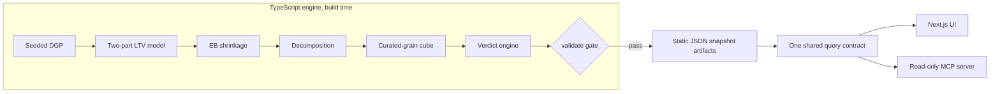

<!--
  README-DRAFT.md — zero-code sections drafted at M0 (2026-07-01).
  Merge into /README.md as sections land. Do NOT let this drift from docs/SPEC.md §13.
  Still owed by later milestones: M1 multiplier tables + recovery charts, M3/M4 MCP
  connect snippet, M4 screenshots + verified quickstart.
-->

# Ground Truth

**The ad platform says winner. The 90-day back end says loser. Ground Truth is the tool that catches the lie before it scales.**

Here's the flip that pays for this entire product: a Meta cell — crypto-curious audience, hype-10x creative, Reels, mobile — reads **2.4x ROAS** in Ads Manager. A clear winner. Scale it. Except that ROAS is impulse buyers smashing a $99 one-time offer inside the platform's 7-day attribution window; Meta books the gross revenue, over-credits itself, and then goes blind. Refunds land at 1.8x the baseline rate over the next month. Nobody renews. True 90-day LTV:CAC on that cell is **0.55** — every dollar in returns fifty-five cents. Ground Truth joins back-end subscriber revenue (renewals, upsells, affiliate commissions, refunds) to the exact acquisition cell that bought each subscriber, predicts LTV from day-3–7 behavior so you act in days instead of quarters, shrinks thin cells toward their parents until they've earned trust, and hands the buyer a Morning Brief of confidence-gated verdicts — **SCALE / KILL / TRIM / WATCH / UNTAPPED** — headlined by two numbers, never one: measured bleed ("Bleeding $2,100/day across 5 cells") and hedged upside ("+$1,300/day potential if reallocated — naive marginal estimate"). Platform dashboards grade their own homework. This is the answer key.

<!-- TODO M4: screenshots — Morning Brief (two-number headline + verdict cards), flip Cell Detail (gauge + payback curve crossing CAC), Explorer on the "Story cells" grain preset -->

---

## What you get

Four surfaces, one set of numbers:

- **Morning Brief** — the two-number headline (bleed measured, upside hedged) and a short stack of move cards: verdict badge, cell path, true LTV:CAC as a bullet bar with an uncertainty whisker against 1x/2x/3x ticks, a platform-vs-truth dumbbell, dollars per day, and a maturity badge ("n=412 · 38d · 18% borrowed"). Six moves, not six hundred rows.
- **Explorer** — a dense, sortable cell table at every registered grain: spend, CPL, CAC, platform ROAS, true LTV:CAC with its range, payback day, dollar impact per day. A "Story cells" preset takes you to the flip and the untapped in two clicks.
- **Cell Detail** — the proof page for any claim on any card: the flip gauge, the payback curve crossing the CAC line, a per-dimension tornado showing what each trait adds or subtracts, and a provenance panel showing exactly how much of the number is observed versus borrowed versus predicted.
- **Read-only MCP server** — every one of those numbers exposed as tools, so your own Claude can interrogate the demo's data directly. The agent narrates; it never computes.

And one vocabulary, five verdicts:

| Verdict | Plain English |
|---|---|
| **SCALE** | Even the cautious end of the uncertainty range clears the hurdle with margin. Feed it. |
| **KILL** | Even the optimistic end of the range is below hurdle, on material spend. Stop feeding it. |
| **TRIM** | Best estimate is below hurdle but the range still straddles it. Cut, don't zero. |
| **WATCH** | Too thin or too young to call. Shown with a leaning ("needs ~10 more days — leaning KILL") and zero dollar claims. |
| **UNTAPPED** | Starved of spend, but its siblings and its traits say it's rich. The inverse flip. |

Plus one overlay: **FLIP** — the platform calls it a winner and the truth calls it KILL or TRIM. Those get the warning diamond, because they're the ones actively costing money while looking good.

---

## Why this?

FinPub economics are simple and brutal: **the front end exists to break even, and the back end is the business.** You buy media at scale, capture the email/SMS subscriber, and get paid over the next 90 days — renewals, upsells, cross-promotions, affiliate sends. The profit arrives 30 to 90 days after the click, on rails the ad platform has never heard of.

Which means the metric stack splits cleanly in two:

| Metric | What it answers | Where it lives |
|---|---|---|
| CPL | What does a lead cost? | Platform dashboard |
| CAC | What does an owned buyer cost? | Platform dashboard, roughly |
| Front-end ROAS | Did day-0 revenue cover the click? | Platform dashboard — and it's *supposed* to hover near 1.0 |
| 90-day LTV | What is a subscriber from this cell actually worth? | **Nowhere the platform can see** |
| Payback day | When does cumulative revenue cross CAC? | Nowhere the platform can see |
| Blended MER | Total revenue over total spend — the real scaling dial | Nowhere the platform can see |

Everything above the line is measured well and optimized hard. Everything below the line is where the money is. Ground Truth exists to move the bottom three up to where the decisions get made.

And it's worse than a blind spot, because the numbers the platform *does* report are biased. Platform attribution:

- **stops at 7 days** — right before the revenue that matters starts;
- **counts gross** — refunds and chargebacks are never subtracted, because platforms never see them;
- **over-credits itself** — every platform claims the same conversion, so blended truth is always less than the sum of the dashboards.

That's not a small bias. It's a bias pointed exactly at the most expensive mistake a buyer can make: it **flatters impulse-heavy cells** (fast gross sales, heavy refunds, zero renewals — the flip) and **starves slow-burn cells** (weak 7-day signal, fat 90-day back end — the untapped). Optimize on platform ROAS and you systematically scale your worst cells and kill your best ones.

It's Today Media's own media-buyer job ad says the team optimizes "front-end metrics (Cost-Per-Lead, CTR, CVR, ROAS) and downstream value (LTV, payback period, Total ROI)." Ground Truth is the join between those two halves — downstream value attributed back to the granular targeting cell (platform × account × campaign × audience × creative × placement × geo × device × offer × cohort-week) where front-end decisions actually get made.

Off-the-shelf attribution (Triple Whale, Northbeam) won't do this: it's DTC-shaped — order-level ROAS for stores — not subscriber-level 90-day LTV per targeting cell for a publisher whose real P&L is a list.

And the payoff isn't just defense. The buyer who knows true 90-day LTV per cell can steer by blended MER instead of platform ROAS, and can pay a CAC that looks insane to a front-end-only competitor — and win every auction that matters. Knowing the back end per cell is **permission to outbid**.

---

## The honest-synthetic data

Every number in this demo is synthetic — and that's the pitch, not the fine print.

The demo runs on a documented, seeded data-generating process: a miniature FinPub world with a full campaign hierarchy, weekly spend dynamics, tens of thousands of subscribers, and 90 days of revenue per subscriber — front-end sales, one-time-offer upsells, renewals, affiliate commissions, whale accounts, refunds — then censored at a snapshot date exactly the way real data is censored. Same seed in, byte-identical artifacts out.

Two stories are deliberately planted in that world, and we tell you so:

| | **The flip** | **The untapped** |
|---|---|---|
| Cell | Meta × crypto-curious × hype-10x × Reels × mobile | YouTube × retirement × education × newsletter-cross-promo × desktop |
| What the platform sees | ~2.0–2.5x ROAS — gross revenue, 7-day window, over-credited | Weak 7-day signal, so the simulated buyer starves it |
| What's true at day 90 | ~0.55 LTV:CAC — refunds at 1.8x baseline, near-zero renewals | ~4.8x LTV:CAC — slow burn, fat back end |
| Verdict | KILL, flagged FLIP | UNTAPPED |
| Why it's realistic | Platforms never see refunds; hype buys once and refunds often | High-LTV audiences often photograph badly in week one |

Planting isn't cheating — it's what makes the demo *checkable*. Real data would prove nothing here, because with real data neither you nor we would know the right answer. With a planted world, there is a right answer, and you can verify the pipeline finds it.

A `validate()` gate runs before any artifact ships: it asserts the flip exists and reads as a platform winner, the untapped cell exists and is starved, sparsity is realistic (most leaf cells have five or fewer subscribers — thin cells are the norm, not the exception), and every interval and headline number is finite and sane. If the planted world isn't recoverable, the build fails.

One thing we will never claim: that the model "rediscovers the DGP." What we claim is stricter and more useful — **the pipeline is scored against ground truth it never reads.** The planted answer key lives in a sidecar file, and an import-graph test asserts that nothing in the model, cube, or query code can even import it. The world it's scored on contains structure the model can't represent — whale gating, zero-inflated revenue, refund dynamics, Pareto tails, snapshot censoring — so recovery validates **pipeline correctness, not model-family choice**. A negative control seals it: score the recovered effects against a permuted answer key and the correlation collapses to ~0.

<!-- TODO M1: multiplier tables (planted m_cac / m_feconv / m_ltv / m_refund per dimension), recovery charts from recovery.json (planted-vs-recovered scatter + negative control, shrunk-beats-raw MAE, out-of-sample calibration deciles) -->

---

## Architecture

One TypeScript repo, one Next.js app on Vercel. The data engine is pure TS with zero framework imports, run as a build-time script that emits static JSON snapshot artifacts. No database, no env vars, no external services the demo can die on during judging.

Every stage explains itself in a sentence — that's a design rule here, not an accident:

- **Seeded DGP** — the synthetic world described above. Deterministic: regenerate from the same seed and the artifacts are byte-identical.
- **Two-part LTV model** — a subscriber's predicted 90-day value is *the chance they ever buy* times *what buyers like them spend*, learned from cohorts old enough that we already know their answer, then scaled so predictions average out correctly on those known cohorts.
- **EB shrinkage** — a thin cell borrows from its parent until it has earned trust; the UI shows this as "% borrowed from parent," never as a Greek letter.
- **Decomposition** — one number per trait: what "Reels" or "hype-10x" adds or subtracts, holding everything else steady. Two families, one for *whether people buy* and one for *what buyers are worth* — which is exactly how the flip works: hype makes people buy once; it doesn't make them worth anything.
- **Curated-grain cube** — every metric precomputed at ~23 registered grains (platform → account → campaign → ad set → leaf, plus audience/creative/geo/device/offer cuts). No free-form OLAP; every grain that exists is one a buyer would actually act at.
- **Verdict engine** — SCALE / KILL / TRIM / WATCH / UNTAPPED, gated on the **80% uncertainty range**, not the point estimate. A cell is only KILL when even the optimistic end of its range is below hurdle; thin or immature cells are forced to WATCH with a stated leaning ("needs ~10 more days — leaning KILL"). No verdict without receipts.
- **validate gate** — artifacts don't ship unless the planted stories are recoverable and every number is sane.

Downstream of the gate, everything is boring on purpose: **static JSON artifacts** are committed to the repo and baked into the deploy, and **one shared query contract** — a handful of pure functions — is the only way anything reads them. The Next.js UI calls it. The read-only MCP server at `/api/mcp` calls it. Claude connected over MCP **narrates the numbers; it never computes them** — the same query returns the same answer whether a human clicks or an agent asks.

The MCP tools mirror how a buyer actually works the data:

- `daily_brief` — the Morning Brief: both headline numbers and the move cards.
- `rank_cells` — sort any registered grain by true LTV per dollar, platform-vs-truth divergence, or dollar impact.
- `get_cell` / `explain_cell` — one cell's full story: verdict, reason, uncertainty range, % borrowed from parent, and what each trait adds or subtracts.
- `list_flips` — every cell where the platform and the truth disagree, ranked by daily cost.
- `find_untapped` — starved cells whose siblings and traits say they deserve budget.
- `draft_budget_change` — a structured, reversible proposal plus a CSV. It drafts; it never executes.

A few rules hold everywhere, because trust is the product:

- **Read-only mandate.** Nothing in this system writes to an ad platform. Proposals are drafts.
- **One contract.** UI and agent read identical numbers from identical functions — they cannot disagree.
- **No verdict without receipts.** Verdicts gate on uncertainty ranges, sample floors, and maturity floors, in the engine — not in UI copy.
- **Every number explainable in a sentence or two.** If a method can't be explained to a media buyer in plain English, it doesn't ship. The Methodology drawer carries the one-sentence gloss next to every formula.
- **Money is integer cents internally.** Formatting happens at the edge, rounding errors don't compound.

The UI vocabulary follows the same rule — plain words, defined once, used everywhere:

- **Uncertainty range** — the 80% band around a cell's true LTV:CAC. Verdicts are made against the ends of this band, not the middle.
- **% borrowed from parent** — how much of a thin cell's number comes from its parent in the hierarchy. A brand-new cell borrows almost everything; a seasoned one stands alone.
- **Confidence** — a 0-to-1 blend of sample size, cohort maturity, and how little the cell had to borrow.
- **Maturity** — how much of this cohort's 90-day window has actually elapsed. A 20-day-old cohort's LTV is mostly prediction, and the provenance panel says so.

<!-- TODO M3/M4: MCP connect snippet — claude mcp add --transport http ground-truth https://DEMO-URL/api/mcp (plus npx mcp-remote fallback for Claude Desktop) -->

### Production path

The demo swaps in synthetic data where production would have an ingestion rail. The swap points are explicit, and nothing downstream of the artifacts changes:

- **The join, made free at click time:** a `/c` edge redirect stamps every outbound click with a click-id carrying the full cell definition before the visitor ever hits the lander; a `/postback` endpoint receives subscription, renewal, refund, and affiliate-payout events keyed to that click-id. That one rail replaces the entire "which ad bought this subscriber" forensics problem.
- **Storage:** in-memory arrays → DuckDB for the nightly cube build → Postgres for serving. The artifact schema is the contract; only the producer changes.
- **Model:** the transparent two-part GLM → LightGBM (Tweedie / quantile) once real volume earns it — same features, same calibration discipline, better tails. The GLM ships first because every number it produces can be explained to a media buyer in one sentence.
- **Cadence:** build-time script → nightly snapshot job. The UI, the MCP server, and the query contract don't change at all.

---

## What's next

Ground Truth is deliberately read-only: it decides nothing, it *knows* things — and it's built to plug into the AI stack It's Today Media has already announced publicly. Three beats:

1. **Verdicts become actions — behind guardrails.** Their /role page announces an "automated ad creation and upload workflow via MCP server." Ground Truth's verdicts are already MCP tool calls; `draft_budget_change` already emits structured, reversible proposals. The integration is one hop: Ground Truth proposes, their execution workflow disposes — behind spend caps, human confirm, rollback, and an audit log. Read-side and write-side stay separate systems, which is exactly what you want when an agent touches ad budgets.
2. **Provenance stamped at mint.** Their announced landing-page generator and CMS mints every page. Stamp the acquisition cell into the page at mint time and the back-end join stops being an attribution project — every lead arrives already knowing which cell bought it. The `/c` redirect rail above becomes a formality.
3. **Their engagement exhaust becomes the early-warning system.** The email/SMS lists they build are also a behavioral stream — opens, clicks, SMS opt-ins, first purchases in days 3–7. Those are precisely the early-behavior features this model already consumes to predict 90-day LTV before it exists. Wire those streams in and scale/kill calls that used to take a quarter of hindsight happen in the first week.

End state: every dollar of spend knows its true 90-day return, early enough to act on, with an agent that can propose the reallocation and a workflow that can execute it safely. That's the whole game in this business — **permission to outbid.**

---

## Cost model

Tokens are a rounding error; the bill is the join.

- **LLM cost scales with analyst questions, not with leads.** The engine precomputes every number at build time; Claude narrates precomputed answers over MCP. A media-buying team asks dozens of questions a day whether the list has fifty thousand subscribers or five million — analysis cost is flat while the business scales.
- **This demo: ~$0/month.** Static JSON on Vercel's free tier, no database, no env vars, no server-side LLM calls. A judge connecting Claude to the MCP endpoint spends their own narration tokens — pennies.
- **Production: roughly $0.5–3k/month, dominated by data infrastructure, not tokens.** Which is the right shape for this business: the expensive part is *knowing the truth*, and it's a fixed cost; acting on it is nearly free.

| Line item | Demo | Production (order of magnitude) |
|---|---|---|
| Hosting + serving | $0 — static artifacts on Vercel | Low hundreds/mo |
| Click/postback rail | n/a — synthetic | Low hundreds/mo at edge scale |
| Warehouse + nightly builds | n/a — build-time script | Hundreds to ~$2k/mo as volume grows |
| LLM tokens | ~$0 server-side | Tens of dollars/mo — a team's daily MCP questions |

---

## The BS-checks

Questions a veteran buyer should ask this tool — asked and answered up front:

- **"Is that one big 'misallocated' number just bleed and upside added together?"** No, and it never will be. Bleed is *measured* — spend already going out at a known losing rate. Upside is a *naive marginal estimate* — it assumes the next dollar performs like the last one, which is exactly what a real reallocation would test. They're different kinds of claims, so they're different numbers, and the hedge is printed on the card.
- **"Do overlapping cells double-count?"** No. The Brief is assembled so that no two cards claim the same underlying spend; a cell that shows up at multiple grains is folded into one card and cross-referenced, not counted twice. Total claimed bleed can never exceed actual daily spend.
- **"One whale in a retirement cohort would wreck these averages."** Whale revenue is capped at a disclosed ceiling before any cell math, and whale-eligible audiences are calibrated separately. The cap and the reasoning sit in the Methodology drawer.
- **"A 40-subscriber ad set can't support a kill call."** Agreed — that's what the machinery is for. Thin cells borrow from their parents, verdicts gate on the cautious end of the uncertainty range plus sample and maturity floors, and anything that fails those floors is forced to WATCH with zero dollar claims attached.
- **"So it's another dashboard."** It's a verdict engine with a dashboard on top — and an agent rail beside it. Dashboards report; this thing says KILL, shows its receipts, and drafts the budget change.

---

## The two-minute tour

The fastest path through the demo, in the order the argument builds:

1. **Open the Morning Brief.** Read the two headline numbers and notice they are not added together. Find the card with the warning diamond.
2. **Click the flip.** Watch a 2.4x platform winner turn into a 0.55 true LTV:CAC loser: the gauge shows the gap, the payback curve never crosses the CAC line, and the tornado shows hype-10x pulling value down while pushing conversion up — the whole mechanism in one screen.
3. **Open the Explorer on the "Story cells" preset.** Sort by platform-vs-truth divergence. The flip and the untapped are two clicks from anywhere.
4. **Open the Methodology drawer.** Every formula has a one-sentence gloss, every threshold is printed, and the synthetic-data disclosure is one click from every number in the app.
5. **Connect your own Claude to the MCP endpoint** and ask it for the daily brief, then ask *why* the flip cell is a KILL. It will answer with the same numbers you just saw — because it's reading them, not computing them.

---

<!-- TODO M4: quickstart — npm i && npm run generate && npm test && npm run dev, verified on a clean clone; live demo URL + repo link up top -->
